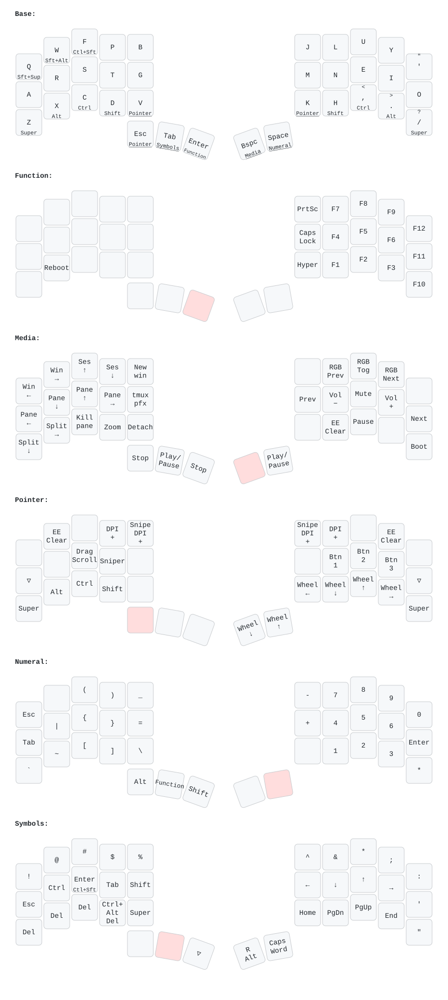

# Charybdis (3x5) `cdub` keymap

A Colemak-DH layout with [Miryoku-inspired layers](https://github.com/manna-harbour/miryoku),
mods on the bottom row rather than the home row, and some features and changes
specific to the Charybdis.

## Layout



Regenerate this diagram after editing `keymap.c`:

```console
$ make keymap-svg      # from the userspace root
```

The diagram is drawn from `keymap.yaml`, which is maintained **by hand** — update
it to match `keymap.c` before regenerating. It needs `uv` (which fetches
[keymap-drawer](https://github.com/caksoylar/keymap-drawer) on demand) and
`rsvg-convert` from librsvg.

### Layers

| # | Layer | Reached by |
| - | ----- | ---------- |
| 0 | Base | — |
| 1 | Function | hold left inner thumb (`Enter`); or `MO` on the Numeral layer |
| 2 | Navigation | **nothing — this layer is currently unreachable** |
| 3 | Media | hold right thumb 1 (`Bspc`) |
| 4 | Pointer | hold left thumb 1 (`Esc`), or `V` / `K` |
| 5 | Numeral | hold right thumb 2 (`Space`) |
| 6 | Symbols | hold left thumb 2 (`Tab`) |

Mods live on the bottom row (`Z X C D` = Super/Alt/Ctrl/Shift, mirrored right),
with combined mod-taps on the left top row: `Q` = Shift+Super, `W` = Shift+Alt,
`F` = Ctrl+Shift.

This layout supports RGB matrix. However, due to space constraints on the MCU, only a limited number of effect can be enabled at once. Look at the `config.h` file and enable your favorite effect.

This layout also supports VIA.

## Customizing the keymap

### Dynamic DPI scaling

Use the following keycodes to change the default DPI:

-   `POINTER_DEFAULT_DPI_FORWARD`: increases the DPI; decreases when shifted;
-   `POINTER_DEFAULT_DPI_REVERSE`: decreases the DPI; increases when shifted.

There's a maximum of 16 possible values for the sniping mode DPI. See the [Charybdis documentation](../../README.md) for more information.

Use the following keycodes to change the sniping mode DPI:

-   `POINTER_SNIPING_DPI_FORWARD`: increases the DPI; decreases when shifted;
-   `POINTER_SNIPING_DPI_REVERSE`: decreases the DPI; increases when shifted.

There's a maximum of 4 possible values for the sniping mode DPI. See the [Charybdis documentation](../../README.md) for more information.

### Drag-scroll

Use the `DRAGSCROLL_MODE` keycode to enable drag-scroll on hold. Use the `DRAGSCROLL_TOGGLE` keycode to enable/disable drag-scroll on key press.

### Sniping

Use the `SNIPING_MODE` keycode to enable sniping mode on hold. Use the `SNIPING_MODE_TOGGLE` (aliased as `SNP_TOG`) keycode to enable/disable sniping mode on key press.

Change the value of `CHARYBDIS_AUTO_SNIPING_ON_LAYER` to automatically enable sniping mode on layer change. By default, sniping mode is enabled on the pointer layer:

```c
#define CHARYBDIS_AUTO_SNIPING_ON_LAYER LAYER_POINTER
```

### Auto pointer layer

The pointer layer can be automatically enabled when moving the trackball. To enable or disable this behavior, add or remove the following define:

```c
#define CHARYBDIS_AUTO_POINTER_LAYER_TRIGGER_ENABLE
```

By default, the layer is turned off 1 second after the last registered trackball movement:

```c
#define CHARYBDIS_AUTO_POINTER_LAYER_TRIGGER_TIMEOUT_MS 1000
```

The trigger sensibility can also be tuned. The lower the value, the more sensible the trigger:

```c
#define CHARYBDIS_AUTO_POINTER_LAYER_TRIGGER_THRESHOLD 8
```

## The tmux hand (Media layer, left side)

Hold `Bspc` with the right thumb and the left hand becomes tmux control.
Pane selection sits on the home row because it is the most frequent action;
window and session movement are on the top row; the structural commands are on
the bottom row, furthest from an accidental press.

Most of these are plain mod-wrapped keycodes, not macros, because the live tmux
config binds them prefix-free (`bind -n`) to Alt and Ctrl+Alt chords. Only new
window, zoom and detach need the prefix, and those are the three custom
keycodes in `process_record_user()`.

`tmux pfx` (home row, index finger) emits `C-b` -- tmux's `prefix2` -- and
covers everything without its own key: `s`, `[`, `w`, `k`, `r`.

Note that `~/.tmux.conf` is stale and not loaded; the live config is
`~/.config/tmux/tmux.conf`.

## Constraints worth knowing

- **Combos and tap dance cannot be defined here.** The argos module
  (`modules/bastardkb/argos/`) defines `combo_count()`/`combo_get()` and
  `tap_dance_count()`/`tap_dance_get()` non-weak, overriding QMK's weak
  versions, and drives both from EEPROM via the Argos configurator (16 combo
  slots, 4 keys each). Combos written in `keymap.c` are silently ignored.
  Escaping this means forking the `modules/bastardkb` submodule.
- **`TAPPING_TERM_PER_KEY` has no effect.** argos defines `get_tapping_term()`
  non-weak, so the tapping term is one global value.
- **`process_record_user()` is reachable twice per key event.**
  `bk_pointing_device.c` calls it from inside its own module hook, in addition
  to the normal `process_record_kb()` path. Handlers must return `false` to
  short-circuit the second dispatch, or every macro fires twice.
- **The Symbols layer's `LCA(KC_DELETE)` is deliberate.** Hold `Tab`, press
  `D`, and you send `Ctrl+Alt+Delete`, which Hyprland binds to *close all
  windows* (`hyprctl binds` shows `modmask=12 key=DELETE`). This is the only
  non-`SUPER` Hyprland binding that collides with anything this keymap emits.
  It is kept on purpose -- do not "fix" it.
- **The tmux hand is inert in copy-mode.** While a pane is in copy-mode the
  `copy-mode-vi` key table takes precedence over `bind -n`, so every key on
  the tmux hand except `tmux pfx` does nothing there.
